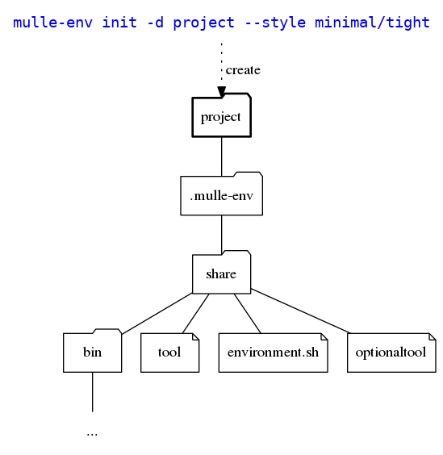

# mulle-env, 🌳 Virtual environment for Unix

**mulle-env** provides a virtual environment as an interactive bash shell.
Developing inside the mulle-env shell protects you from the following
common mistakes:

* inadvertant reliance on non-standard tools
* reproducability problems due to non-standard environment variables

With **mulle-env** you can easily manage

* the command line tools available in the virtual environment
* additional virtual environment variables with multiple scopes, like on a per-user or per-host basis.

Therefore any directory can become a self contained virtual environment with
mulle-env.


Commands            | Description
--------------------|--------------------------------
`mulle-env`         | Virtual environment sub-shell
`mudo`              | Run a command with the unrestricted PATH
`mulle-env-reload`  | Refresh virtual environment variables


## Install

## Packages

OS      | Command
--------|------------------------------------
macos   | `brew install mulle-kybernetik/software/mulle-env`
debian  | `sudo apt-get -y install mulle-env` (but see below)
ubuntu  | same as debian


Otherwise see [mulle-sde-developer](//github.com/mulle-sde/mulle-sde-developer)
how to install mulle-sde, which will also install **mulle-env**.


#### Debian Mulle kybernetiK repository

For apt installation you need to add the Mulle kybernetiK debian repository
first:

```
wget -O - "https://www.mulle-kybernetik.com/dists/debian-admin-pub.asc" | sudo apt-key add -
echo "deb [arch=all] http://www.mulle-kybernetik.com `lsb_release -c -s` main" | sudo tee "/etc/apt/sources.list.d/mulle-kybernetik.com-main.list" > /dev/null
sudo apt-get update
```

## What mulle-env does in a nutshell


mulle-env uses `env` to restrict the environment of the subshell to a minimal
set of values. With `env -i bash -c env` you can see the restricted environment

```
PWD=/home/src/srcS/mulle-env
SHLVL=1
_=/usr/bin/env
```

mulle-env adds a few environment variables back to the environment, like
LOGNAME or SSH_AUTH_SOCK, so that an interactive shell keeps functioning like
one would expect to. You can see the effect for yourself with:

```
mulle-sde init -d /tmp/xxx
mulle-sde -d /tmp/xxx -c env
```

This environment is modified by reading a profile file 
`.mulle-env/share/environment.sh`. With this file new environment variables,
especially PATH and aliases can be defined. Usually you do not manually edit
this files, but use mulle-env commands and mulle-env plugins to customize the
environment to your liking.


## Prepare a directory to use mulle-env

A directory must be initialized, before you can run the **mulle-env** subshell
it it. Let's try an example with a `project` directory. We want a minimal
portable set of commandline tools, so we specify the 'style' as "minimal/tight".

```
mulle-env init -d project --style minimal/tight
```

And this is what happens:




```
$ mulle-env project
Enter the environment:
   mulle-env "project"
$ mulle-env "project"
$ ls
$ echo $PATH
/tmp/project/.mulle-env/var/<hostname>/bin
$ ls -l $PATH
total 0
lrwxrwxrwx 1 nat nat 12 Jan 21 22:28 awk -> /usr/bin/awk
lrwxrwxrwx 1 nat nat 15 Jan 21 22:28 base64 -> /usr/bin/base64
...
...
...
lrwxrwxrwx 1 nat nat 14 Jan 21 22:28 which -> /usr/bin/which
```

And we leave the subshell with

```
$ exit
```

You can also run a command in the environment without an interactive subshell
with the '-c' flag, like you would using bash:


```
$ mulle-env -c 'echo "${PATH}"'
```


## Styles

A style is mix of a tool-style and an environment style of the form
`<tool>/<env>`.

The env style determines the filtering of the environment variables.

The tool style determines the change of the PATH variables,
in the environment styles `tight`, `relax`, `inherit`.

> Toolstyles can be augmented with plugins. See `mulle-env toolstyles` for
> what's available.

Tool Style  | Descripton
------------|--------------------------
`none`      | No default commands available.
`minimal`   | PATH with a minimal `/bin` like set of tools like `ls` or `chmod`
`developer` | PATH with a a set of common unix tools like `awk` or `man` in addition to `minimal`


Environment Style | Description
------------------|--------------------------
`tight`           | All environment variables must be defined via `mulle-env`
`relax`           | Inherit some environment environment variables (e.g. SSH_TTY)
`restrict`        | In addition to `relax`  + all /bin and /usr/bin tools
`inherit`         | The environment is restricted but tool style is ignored and the original PATH is unchanged.
`wild`            | The environment unchanged and the tool style is ignored.


## Enviroment

#### Enter the subshell

```
mulle-env
```


#### Leave the subshell

```
exit
```

#### Run any command

```
mulle-env -c ls
```


## Upgrade an environment

To upgrade an environment to a newer mulle-env release use

```
mulle-env upgrade
```


## Manage tools

List all tools

```
mulle-env tool list
```

Add a tool

```
mulle-env tool add git
```

Remove a tool

```
mulle-env tool remove git
```


## Manage environment variables


There are multiple environment variable domains, that override each other
in top (weakest) to bottom (strongest) fashion. User values should not be
manipulated by tools, where as non-user values will lose changes on
later mulle-env upgrades.


Domain        | User Value | Description
--------------|------------|----------------------------------
`plugin`      | NO         | Values set by a mulle-env plugin
`global`      | YES        | Global user values
`os-<name>`   | YES        | Operating system specific user values
`host-<name>` | YES        | Host specific user values
`user-<name>` | YES        | User specific user values


List all environment variables

```
mulle-env environment list
```

Set an environment variable

```
mulle-env environment --global set FOO "whatever"
```

Get an environment variable

```
mulle-env environment get FOO
```

Remove an environment variable

```
mulle-env environment remove FOO
```


## Tips and Tricks


#### Add /bin and /usr/bin to your sub-shell PATH

Use `mulle-env --style none/restrict init` when initalizing your environment.


#### Reinitialize an environment

Use `mulle-env -f init` to overwrite a previous environment.


#### Specify a global list of tools

Tools that you always require can be specified in your home directory as
`~/.config/mulle-env/tool`. These will be installed in addition to those found
in `.mulle-env/etc/tool`.


#### Specify optionals tools

Tools that are nice to have, but aren't required can be placed into
`.mulle-env/etc/optionaltool`. A non-required tool does not prevent a subshell
from running.


#### Specify platform specific tools

If you need some tools only on a certain platform, figure out the platform name
with `mulle-env uname`. Then use this name (`MULLE_UNAME`) as the extension for
`~/.config/mulle-env/tool.${MULLE_UNAME}` or
`.mulle-env/etc/tool.${MULLE_UNAME}`.

Platform specific tool configuration files take precedence over the
cross-platform ones without the extension.


#### Specify personal preferences (like a different shell)

Short of executing `exec zsh` - or whatever the shell flavor du jour is -
everytime you enter the **mulle-env** subshell, you can add this at the end
of a `.mulle-env/etc/environment-custom.sh` file:

```
$ cat <<EOF >> .mulle-env/etc/environment-custom.sh
if [ "${LOGNAME}" = "moi"]
then
   case "${MULLE_SHELL_MODE}" in
      *INTERACTIVE*)
         exec /bin/zsh
      ;;
   esac
fi
EOF
```
