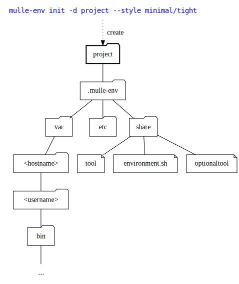

# 🌳 Virtual environment for C and Objective-C

... for Android, BSDs, Linux, macOS, SunOS, Windows (MinGW, WSL)

**mulle-env** provides a virtual environment as an interactive bash shell.
Developing inside the virtual environment protects you from the following
common mistakes:

* inadvertant reliance on non-standard tools
* reproducability problems due to personal or non-standard environment variables

With **mulle-env** you can easily manage

* the command line tools available in the virtual environment
* additional environment variables with multiple scopes, like on a per-user or per-host basis.

You can turn any directory into a self contained virtual environment.
`mulle-env init` will create a `.mulle` folder to hold all permanent and
temporary data. Remove that folder and the virtual environment is gone.

Another benefit of the virtual environment is a per-project command shell
history.


| Release Version                                       | Release Notes
|-------------------------------------------------------|--------------
|   | [RELEASENOTES](RELEASENOTES.md) |

| Executable          | Description
|---------------------|--------------------------------
| `mulle-env`         | Virtual environment sub-shell
| `mudo`              | Run a command with the unrestricted PATH/environment
| `mulle-env-reload`  | Refresh virtual environment variables


## Init a directory to use mulle-env

A directory must be initialized, before you can run the **mulle-env** subshell
it it. Let's try an example with a `project` directory. We want a minimal
portable set of commandline tools, so we specify the 'style' as "minimal/tight".

``` sh
mulle-env init -d project --style minimal/tight
```

And this is what happens:



Temporary and host-specific data is kept in `var`. User edits in `etc`.
`mulle-env` installs its content in `share` (and write protects it).

``` sh
$ mulle-env project
Enter the environment:
   mulle-env "project"
$ mulle-env "project"
$ ls
$ echo $PATH
/tmp/project/.mulle/var/<hostname>-<username>/env/bin
$ ls -l $PATH
total 0
lrwxrwxrwx 1 nat nat 12 Jan 21 22:28 awk -> /usr/bin/awk
lrwxrwxrwx 1 nat nat 15 Jan 21 22:28 base64 -> /usr/bin/base64
...
...
...
lrwxrwxrwx 1 nat nat 14 Jan 21 22:28 which -> /usr/bin/which
```

And we leave the subshell with

``` sh
$ exit
```

You can also run a command in the environment without an interactive subshell
with the '-c' flag, like you would using bash:


``` sh
$ mulle-env -c 'printf "%s\n" "${PATH}"'
```


## Environment

### In an out

Enter the subshell with `mulle-env` and leave the subshell `exit`.
Run any command in the subshell (from the outside to the inside) with a
command like `mulle-env -c env` and escape the subshell (from the inside to
the outside) with `mudo -e env`.

## Upgrade an environment

To upgrade an environment to a newer mulle-env release use

``` sh
mulle-env upgrade
```


### Manage variables

List all environment variables defined by the virtual environment
with `mulle-env environment list`. Set an environment variable
with `mulle-env environment --scope global set FOO "whatever"`.

You can also get an environment variable with `mulle-env environment get FOO`
and remove it with `mulle-env environment remove FOO`.

#### Scopes

There are multiple environment variable scopes, that override each other
in top (weakest) to bottom (strongest) fashion. Non-user values will lose
changes on mulle-env upgrades, so don't write into those scopes.


| Scope         | User Value | Description
|---------------|------------|----------------------------------
| `plugin`      | NO         | Values set by a mulle-env plugin
| `global`      | YES        | Global user values
| `os-<name>`   | YES        | Operating system specific user values
| `host-<name>` | YES        | Host specific user values
| `user-<name>` | YES        | User specific user values

### Manage tools

Tools are your standard unix tools, executables like `cc`, `ls` or `make`.
With the PATH restrictions enforced my mulle-env, you can prune the number
of available tools to the subshell.

To list all tools use `mulle-env tool list`. You can add a tool with
`mulle-env tool add git` and remove it with `mulle-env tool remove git`.

### Styles

A style is mix of a tool-style and an env-style of the form
`<tool>/<env>`. The env-style determines the filtering of the environment
variables. The tool-style influences the content of the `PATH` variable.

> Toolstyles can be augmented with plugins. See `mulle-env toolstyles` for
> what's available.

| Tool Style  | Descripton
|-------------|--------------------------
| `none`      | No default commands available.
| `minimal`   | PATH with a minimal `/bin` like set of tools like `ls` or `chmod`
| `developer` | PATH with a a set of common unix tools like `awk` or `man` in addition to `minimal`
| `mulle`     | *if mulle-sde is installed this tool style is also available*


| Environment Style | Description
|-------------------|--------------------------
| `tight`           | All environment variables must be defined via `mulle-env` (academic needs only)
| `restrict`        | Inherit some environment environment variables (e.g. SSH_TTY)
| `relax`           | Like `restrict` plus `PATH` adds all `/bin` and `/usr/bin` tools
| `inherit`         | The environment is restricted but tool style is ignored and the original PATH is unchanged.
| `wild`            | The user environment remains unchanged and the tool style is ignored.


## What mulle-env does in a nutshell

mulle-env uses `env` to restrict the environment of the subshell to a minimal
set of values. With `env -i bash -c env` you can see the restricted environment

``` bash
PWD=/home/src/srcS/mulle-env
SHLVL=1
_=/usr/bin/env
```

mulle-env adds a few environment variables back to the environment, like
`LOGNAME` or `SSH_AUTH_SOCK`, so that an interactive shell keeps functioning
like one would expect it to. You can see the effect for yourself with:

``` bash
mulle-env invoke env  # this does not read a custom environment
```

### Custom environment

When a mulle-env subshell executes, the environment is modified by reading a 
profile file `.mulle/share/env/environment.sh`. This file in turn will read 
other files in `.mulle/share/env` and `.mulle/etc/env`. With these files 
you define new environment variables and aliases. 

Usually you do not manually edit this files, but use mulle-env *commands*
to customize these environment files.

If you want to go manual, it's suggested you use `.mulle/etc/env/environment-global.sh`
as a starting point:

Example:

``` bash
mkdir -p .mulle/etc/env
echo "FOO=xxx" > .mulle/etc/env/environment-global.sh
```


## Environment

### In an out

Enter the subshell with `mulle-env` and leave the subshell `exit`.
Run any command in the subshell (from the outside to the inside) with a
command like `mulle-env -c env` and escape the subshell (from the inside to
the outside) with `mudo -e env`.

## Upgrade an environment

To upgrade an environment to a newer mulle-env release use

``` sh
mulle-env upgrade
```


### Manage variables

List all environment variables defined by the virtual environment
with `mulle-env environment list`. Set an environment variable
with `mulle-env environment --scope global set FOO "whatever"`.

You can also get an environment variable with `mulle-env environment get FOO`
and remove it with `mulle-env environment remove FOO`.

#### Scopes

There are multiple environment variable scopes, that override each other
in top (weakest) to bottom (strongest) fashion. Non-user values will lose
changes on mulle-env upgrades, so don't write into those scopes.


| Scope         | User Value | Description
|---------------|------------|----------------------------------
| `plugin`      | NO         | Values set by a mulle-env plugin
| `global`      | YES        | Global user values
| `os-<name>`   | YES        | Operating system specific user values
| `host-<name>` | YES        | Host specific user values
| `user-<name>` | YES        | User specific user values


## Install

See [mulle-sde-developer](//github.com/mulle-sde/mulle-sde-developer) how to
install mulle-sde, which will also install mulle-env with required
dependencies.

The command to install only the latest mulle-env into
`/usr/local` (with **sudo**) is:

``` bash
curl -L 'https://github.com/mulle-sde/mulle-env/archive/latest.tar.gz' \
 | tar xfz - && cd 'mulle-env-latest' && sudo ./bin/installer /usr/local
```


## Author

[Nat!](https://mulle-kybernetik.com/weblog) for Mulle kybernetiK


